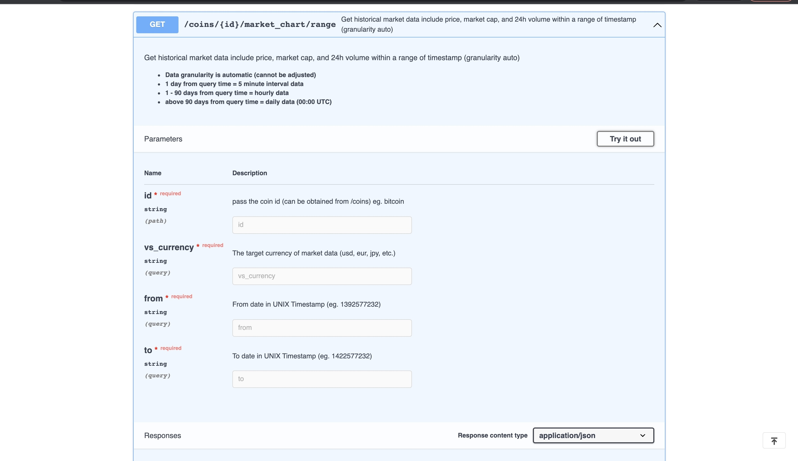
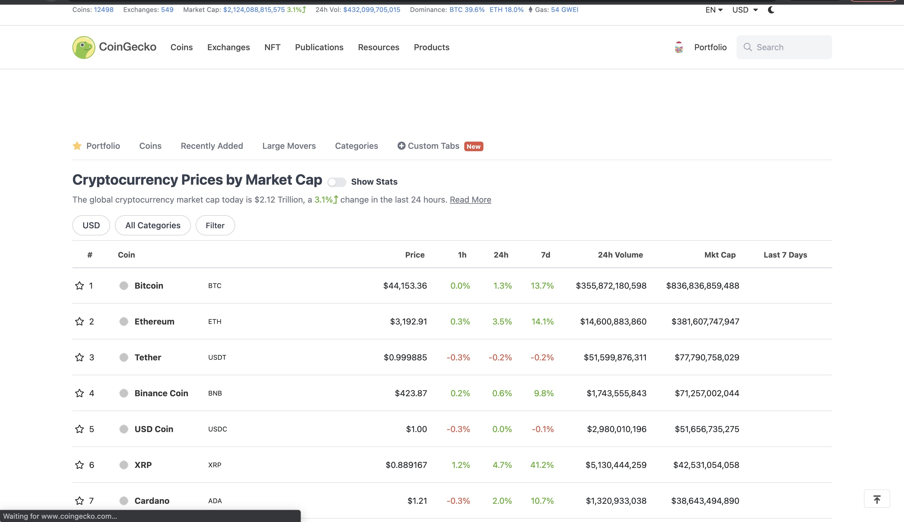

# Cryptocurrency Portfolio Analysis

The idea to create the crypto portfolio analysis tool was due to the growing interest of the people around the world about the cryptocurrency investment.

This tool allows to the user to create a cryptocurrency portfolio based on the analysis of forecast simulations of the performance of different crypto coins, providing data and graphics that helps to decide what crypto-coins to include in the portfolio and the quantity of each one.

The data is provided by Coingecko trough API’s. 

Coingecko was selected as the data provider because is one the most relying data source in the world and they provide more than 7 years of historical data for free. The historical data is a a fundamental component for the data simulation and forecasting.

For the development of the tool there were selected the first five crypto coins according to the ranking by market capitalization of the Coingecko website, at the moment. 

## Process description:

1. Import all the required libraries using the Jupiter Lab program. 
2. Select the cryptocoins for the portfolio.
3. Get the data using API’s requests from Coingecko.
4. Convert the obtained data to JavaScript Object Notation (JSON).
5. Convert JSON data to Pandas DataFrames.
6. Convert Unix date-time format to standard Date format.
7. Consolidate the DataFrames applying the Merge function.
8. Run Montecarlo simulations to make the forecast of the selected cryptocoins.
9. Analyze the results applying plots, summary statistics, and the possible returns of a determined initial investment.
10. Create a cryptocurrency Portfolio and calculate the present value with a 95% of confidence according to the quantity of the chosen Cryptocoins.
11. Analysis of the data using a dashboard of the visualizations. The dashboard provides charts and interactive visualizations that help customers explore and analyze the crypto data and determine if they want to invest in the cryptocurrency market. 
